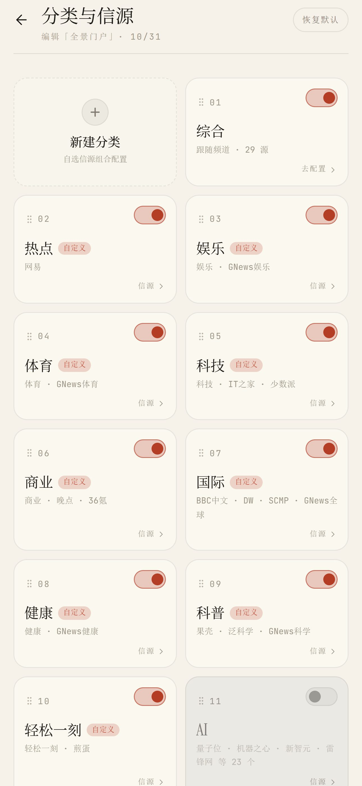
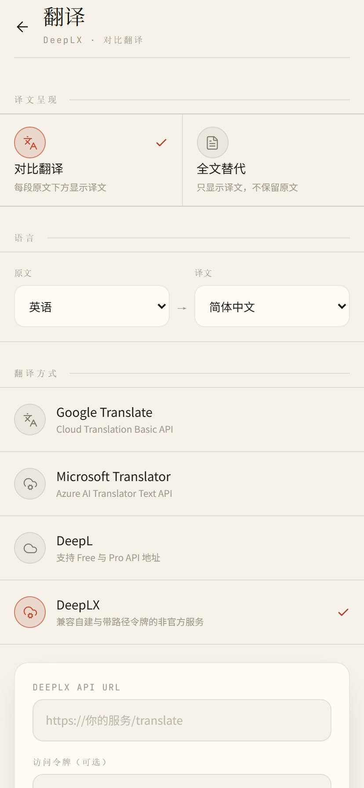

# 有所闻

一款功能专一的 Android 新闻聚合客户端。

不做兴趣画像，不使用算法信息流，不插入广告和垃圾推广。用户自行选择分类与新闻源，客户端直接获取并整理新闻内容，并提供翻译、正文缓存和离线阅读能力。

> 只负责把新闻整理好，不替你决定应该看什么。

## 截图

  
  
  

  
  

## 为什么做这个项目

我不喜欢依赖兴趣推荐的新闻软件。

这类产品通常会根据点击、停留时间和阅读记录持续调整信息流，页面中还经常混入广告、软文、短视频和推广内容。用户看似拥有更多选择，实际接触到的信息却越来越受推荐系统影响。

之前我一直使用一款很简洁的新闻客户端“卡片新闻”。它主要使用网易新闻数据，打开后就是新闻，没有社区、签到、短视频或其他多余功能。但它已经停更多年，在新的 Android 系统上经常闪退。

因此，我参考它的产品思路，重新做了 **有所闻**。

## 主要功能

### 新闻聚合

- 聚合多个中文与英文新闻源
- 按热点、科技、商业、国际、政务等分类浏览
- 支持启用、停用和调整分类顺序
- 支持为每个分类选择具体信源
- 支持综合频道
- 不根据阅读行为推荐内容

### 翻译

支持两种译文呈现方式：

- **对照翻译**：每段原文下方显示译文
- **全文替代**：只显示译文，不保留原文

可选翻译方式包括：

- Android 本地翻译
- Google Cloud Translation
- Microsoft Translator
- DeepL
- DeepLX

本地翻译下载语言包后可离线使用，不需要配置 API 密钥。云端翻译服务需要用户自行填写对应的接口信息。

### 离线阅读

- 完整打开文章后，正文文字和排版可缓存在本机
- 再次打开已缓存文章时，无需等待来源站点
- 支持“稍后读”
- 稍后读文章可优先预取正文
- 正文缓存与列表缓存可分别管理
- 可查看缓存占用并手动清理

正文中的网络图片仍由 Android WebView 按来源站点的缓存策略管理。

### 简洁界面

应用只保留两个主要入口：

- **今天**：浏览分类新闻
- **我的**：管理分类、信源、翻译、外观与离线内容

没有签到、积分、评论区、短视频、社区或信息流广告。

## 工作原理

有所闻采用无自建后端的纯客户端架构。

新闻列表、文章正文和必要的元数据均由 Android 客户端直接获取、解析和整理。应用本身不需要部署独立服务器，也不需要将用户的阅读记录同步到项目方服务器。

这种架构部署简单，但也意味着新闻源接口或网页结构变化后，对应解析规则可能需要更新。

## 隐私

- 不建立用户兴趣画像
- 不根据阅读记录生成推荐结果
- 不要求注册账号
- 阅读记录、稍后读和缓存数据默认保存在本机
- 云端翻译启用后，待翻译文本会发送到用户所选择的翻译服务

第三方新闻源、翻译服务和 Android WebView 可能有各自的数据处理规则，请以对应服务的隐私政策为准。

## 平台支持

目前仅支持：

- Android

暂未提供 iOS、Windows、macOS 或 Web 版本。

## 安装

请前往仓库的 [Releases](../../releases) 页面下载最新 APK。

安装前请确认：

1. Android 系统允许安装来自浏览器或文件管理器的应用。
2. 下载的 APK 来自本仓库发布页面。
3. 升级前无需清除旧版本数据，除非发布说明中特别指出。

> 如果当前仓库尚未发布安装包，请先完成构建并创建 Release。

## 使用说明

### 配置分类与信源

进入：

`我的 → 分类与信源`

你可以：

- 开启或关闭分类
- 调整分类顺序
- 查看每个分类下的信源
- 开启或关闭具体信源
- 恢复默认配置

### 配置翻译

进入：

`我的 → 翻译`

选择：

1. 译文呈现方式
2. 原文语言
3. 目标语言
4. 翻译服务

使用云端翻译时，需要按照页面提示填写 API 地址、密钥或其他服务参数。

### 管理离线内容

进入：

`我的 → 离线存储`

你可以分别查看和清理：

- 正文缓存
- 列表缓存

标题、已读状态和应用设置不在普通缓存清理范围内。

## 项目原则

这个项目会尽量坚持以下原则：

- 新闻阅读优先
- 用户主动选择信源
- 不做算法推荐
- 不加入广告和推广
- 不为了增加停留时间设计功能
- 能在客户端完成的事情，不额外增加服务器依赖
- 新功能不破坏现有的简洁性

## 已知限制

- 新闻源接口和网页结构可能随时变化
- 部分站点可能存在地区、网络或访问频率限制
- 正文解析效果取决于来源页面结构
- 本地翻译的语言支持和效果取决于 Android 系统组件
- 云端翻译可能产生第三方服务费用
- 部分内容的图片、视频或交互组件无法完整离线保存

## 免责声明

有所闻仅作为新闻聚合和阅读工具，不生产、修改或代表任何新闻内容。

新闻标题、摘要、正文、图片和其他内容的著作权归原作者或原发布机构所有。应用展示的内容来自相应新闻源，用户应遵守来源站点的使用条款。

本项目不保证所有新闻源长期可用，也不对第三方内容的准确性、完整性、及时性或立场负责。

## 反馈

发现以下问题时，欢迎提交 Issue：

- 新闻源无法加载
- 列表内容重复或缺失
- 正文解析异常
- 翻译失败
- 缓存或离线阅读异常
- Android 兼容性问题

提交问题时，建议附上：

- 手机型号
- Android 版本
- 应用版本
- 新闻源名称
- 问题页面截图
- 可复现步骤

## 开发状态

项目目前处于持续完善阶段。

后续工作主要包括：

- 提升不同新闻源的解析稳定性
- 完善来源失效后的错误提示
- 优化正文提取与排版
- 改进离线缓存策略
- 增加导入、导出和备份能力
- 完善无障碍与大字体适配

---

**有所闻**：有所选择，有所阅读，有所闻。
