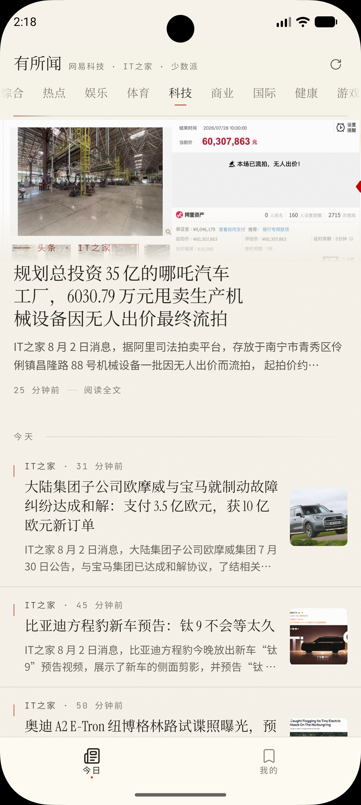
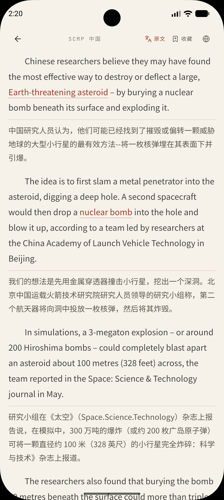
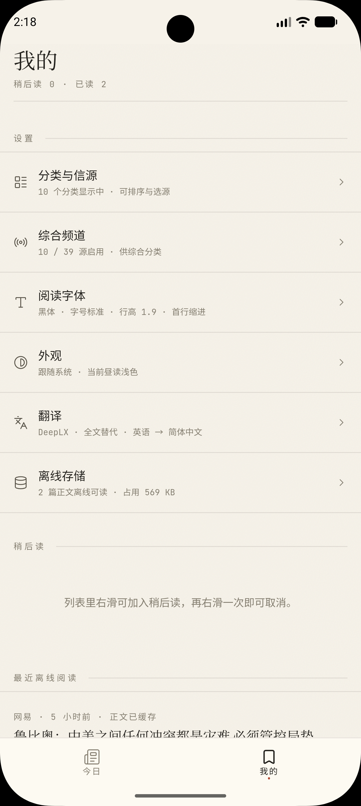
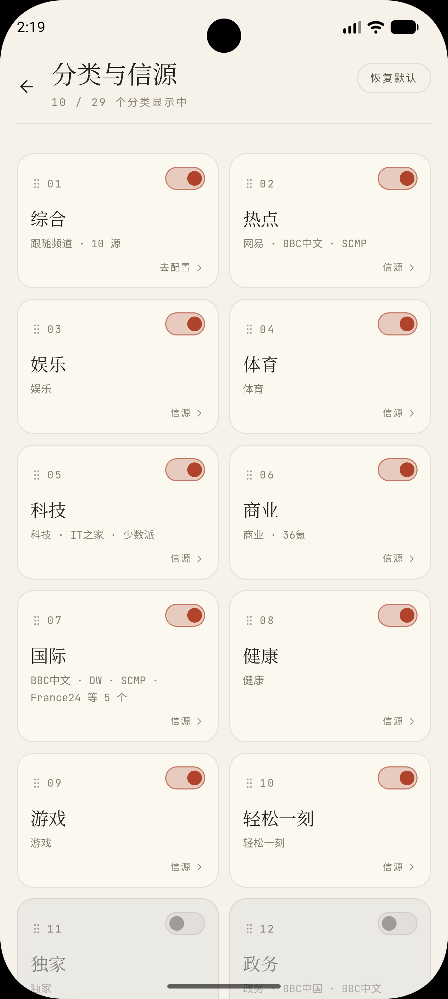
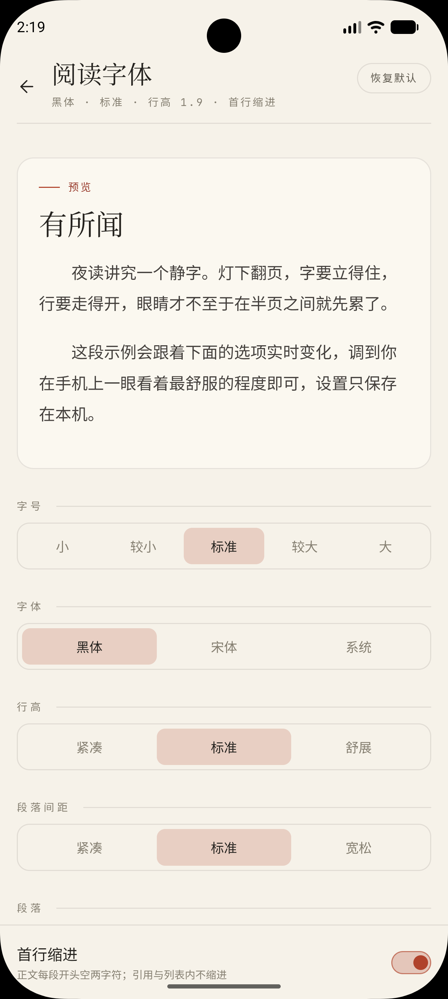
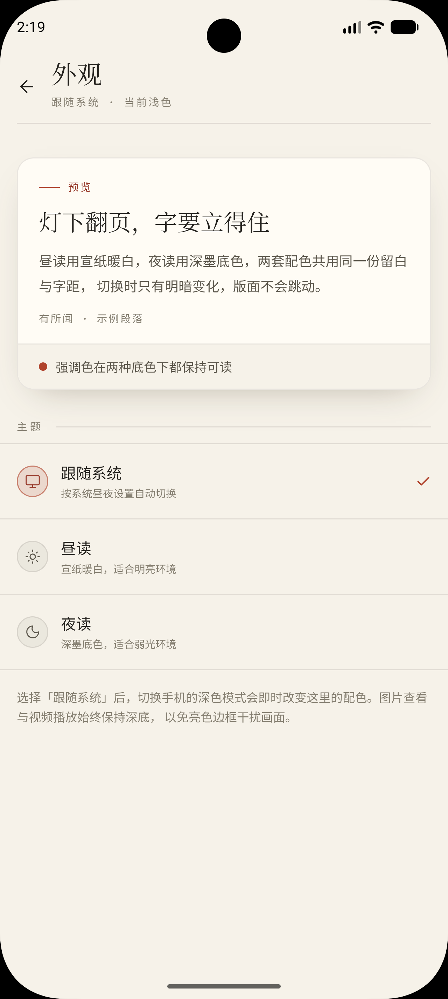
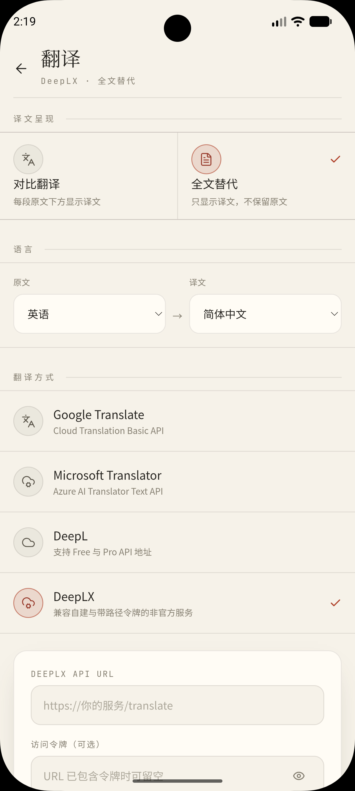

# 有所闻

> 不做算法推荐、不插广告，由用户自己选择信源的 Android 新闻阅读客户端。

打开就是新闻，没有短视频、签到或垃圾推广。分类、信源、排序与翻译方式都由你决定。

项目参考已长期停更的「卡片新闻」：简洁、专注阅读。旧版在新 Android 上难以稳定运行，因此重新实现，并补上多信源、站内全文、翻译与离线阅读等能力。

## 界面预览

<p align="center">
  
  
  
</p>

<p align="center">
  
  
  
  
</p>

## 功能

### 阅读

- **今日信息流**：多源按时间混合；下拉刷新，分类可左右滑动切换
- **站内全文**：提取正文后在 App 内阅读，减少原网页干扰；支持图片查看 / 保存 / 分享
- **视频**：网易等视频稿可在阅读器内播放
- **稍后读 / 最近阅读**：暂存未读完的文章，并保留近期打开记录
- **排版与外观**：字号、字体、行高；浅色 / 深色 / 跟随系统

### 信源与分类

- **多源聚合**：RSS / Atom 与网易等公开接口由客户端直接拉取，无自建业务后端
- **综合频道**：自行启用信源，汇总到「综合」
- **分类管理**：热点、科技、AI、国际、商业等可显隐与排序；也可按单源浏览
- **默认示例**：少数派、IT 之家、36 氪、BBC 中文、DW、SCMP、NPR、Ars、MIT TR、量子位等（可随时开关）

### 翻译

- **对照翻译**：段落下方显示译文，便于核对
- **全文替代**：只看译文，便于快读
- **提供商**：Android 本地翻译（下载语言包后可离线）、Google、Microsoft、DeepL、DeepLX  
  云端翻译需自行配置 API；文本会发往所选服务，费用与隐私以其官方说明为准

### 离线与隐私

- **本地缓存**：已打开文章可再次离线阅读；稍后读优先保留正文
- **纯客户端**：无须注册登录；阅读记录与偏好主要存本机
- **无推荐、无广告**：不建兴趣画像，不插推广内容

## 安装

从仓库 **Releases** 下载 APK。安装时可能需允许「安装未知应用」。

| 变体 | 说明 |
|---|---|
| `cloud` | 轻量版，仅云端翻译 |
| `local` | 含本机 ML Kit 翻译（语言包按需下载） |

二者包名相同，同一设备勿同时安装。当前仅提供 Android。

## 架构（简述）

```text
公开新闻源 → 客户端请求 → 列表解析 / 正文提取 → 分类 · 缓存 · 翻译 → 本地阅读
```

无自建内容服务器，部署简单，但也受上游接口、页面结构与反爬策略影响；源站改版后解析可能需同步更新。

## 新闻源与权利

本项目只做客户端聚合展示，不存储、不运营新闻内容，也不代表任何媒体机构。著作权归原作者与发布平台；请遵守对应站点条款与当地法律。

## 已知限制

- 部分源受地区、网络或访问频率限制；站点改版可能导致暂时无法解析
- 登录墙 / 付费墙无法完整获取正文
- 图片与视频不一定能完整离线；云端翻译可能产生费用
- WebView 版本可能影响个别页面显示

## 反馈

欢迎通过 Issue 反馈：源失效、正文提取错误、翻译问题、崩溃、新源建议、交互建议。

请尽量附上：Android 版本、应用版本、设备型号、信源名称、文章链接、截图或日志、复现步骤。

## 致谢

感谢公开内容、开放接口与开源工具的提供者。

感谢 [Linux.do](https://linux.do) 社区提供的平台与交流环境，讨论与分享对本项目帮助很大。
