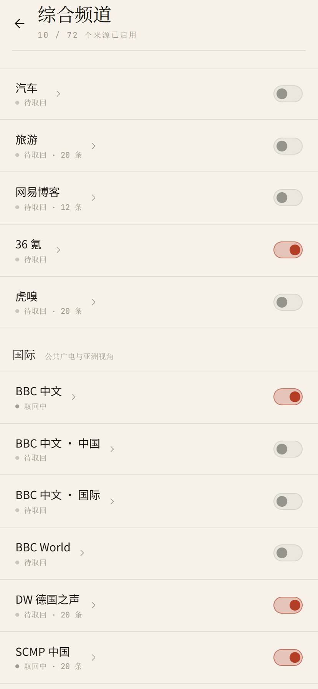
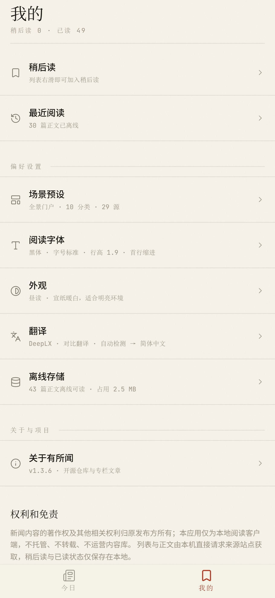
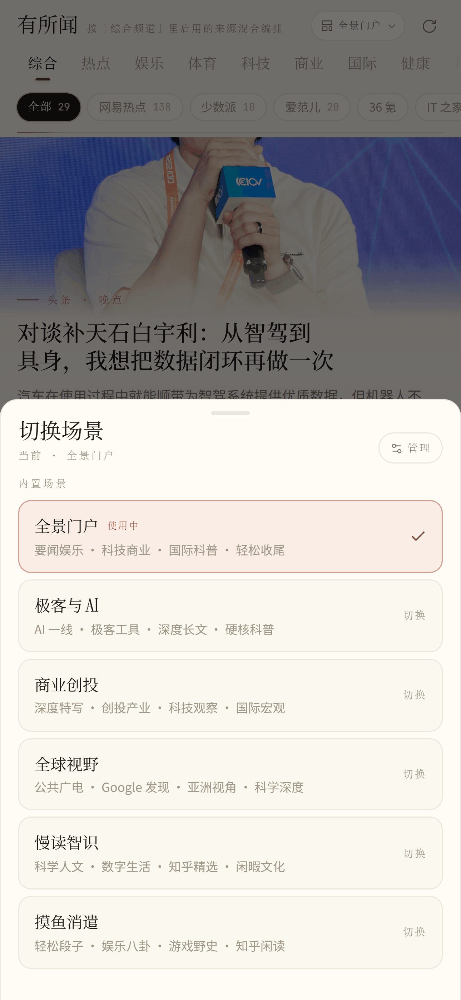
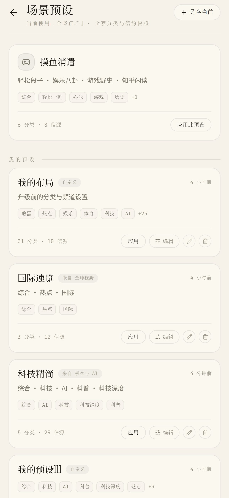
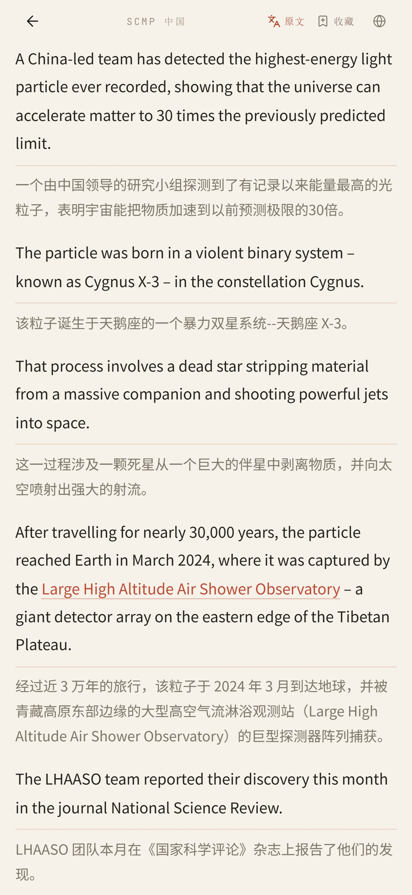
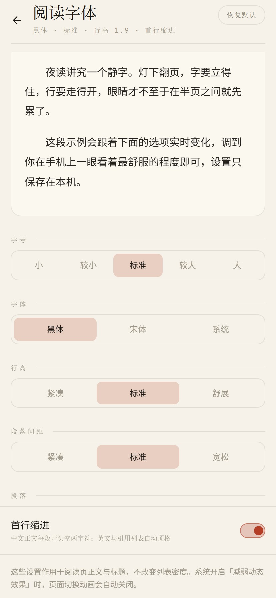
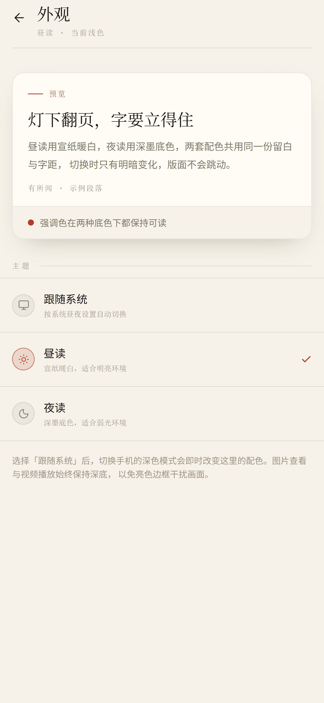

# NewsNook（有所闻）用户操作手册

本地优先的 Android 新闻阅读客户端。无账号、无后端、无推荐算法。订阅由你配置，列表与正文由本机直连上游获取，并在应用内阅读。

本手册对应应用内实际菜单与操作路径。功能概述见 [README](../README.md)；权利与免责见 [legal.md](./legal.md)。

## 目录

- [安装与启动](#安装与启动)
- [主界面：今日](#主界面今日)
- [综合频道与信源](#综合频道与信源)
- [我的](#我的)
- [自定义订阅与 OPML](#自定义订阅与-opml)
- [分类与自动刷新](#分类与自动刷新)
- [场景预设](#场景预设)
- [站内阅读](#站内阅读)
- [翻译](#翻译)
- [稍后读与最近阅读](#稍后读与最近阅读)
- [阅读字体与外观](#阅读字体与外观)
- [网络与代理](#网络与代理)
- [离线存储](#离线存储)
- [关于与更新](#关于与更新)
- [常见问题](#常见问题)

## 安装与启动

发布包见 [Releases](https://github.com/t59688/newsnook/releases)。两个变体**包名与签名相同**，同一设备只需安装其中一个。

| 变体 | 大约体积（以 [Releases](https://github.com/t59688/newsnook/releases) 实际 APK 为准） | 说明 |
| --- | --- | --- |
| 轻量版（云端） | 约 2 MB | 不含本地翻译引擎；可使用云端翻译（Google / Azure / DeepL / DeepLX / AI） |
| 完整版（local） | 约 60 MB | 含 Android 本地翻译（ML Kit）与 Bergamot；语言模型按需下载；Bergamot 当前仅支持 `arm64-v8a` |

步骤：

1. 在 Releases 下载对应 APK。
2. 若系统提示，允许「安装未知应用」。
3. 安装并打开应用。

只需云端 / AI 翻译时，安装轻量版即可。需要 ML Kit 或 Bergamot 离线翻译时，安装完整版。

## 主界面：今日

底部 Tab **今日** 为信息流：顶部是分类轨，下方为当前分类下的文章列表。

今日 · 分类轨与信息流

常用操作：

1. **切换分类**：点顶部分类名，或左右横滑列表切换相邻分类（右滑上一分类，左滑下一分类）。
2. **刷新**：下拉列表，或点右上角刷新。
3. **打开文章**：点条目进入站内阅读。
4. **稍后读**：打开文章后，点阅读器顶栏「收藏」。
5. **单源筛选**（当前分类有多个信源时）：用分类下的信源筛选条只看某一源。

夜读示意：

今日 · 夜读主题

## 综合频道与信源

「综合」分类跟随 **综合频道** 中启用的来源混合编排。其它分类在「分类与自动刷新」中单独选源。

入口：**我的 → 分类与自动刷新 → 频道启用**（界面标题为「综合频道」）。

综合频道 · 按分组管理来源

步骤：

1. 打开「综合频道」。
2. 按分组查看内置源与自建源。
3. 用开关启用或关闭来源。
4. 点某一源可进入该源的单独列表。

状态文案包括：待取回、取回中、正常、未取回。单个源失败不影响其它源。

## 我的

底部 Tab **我的** 汇总阅读收藏与偏好设置。

我的 · 阅读与收藏、偏好设置

| 分组 | 入口 |
| --- | --- |
| 阅读与收藏 | 稍后读、最近阅读 |
| 偏好设置 | 自定义订阅与 OPML、分类与自动刷新、场景预设、阅读字体、外观、翻译、网络与代理、离线存储 |
| 关于与项目 | 关于有所闻 |

## 自定义订阅与 OPML

入口：**我的 → 自定义订阅与 OPML**（进入后页面标题为「自定义订阅」）。

支持标准 **RSS / Atom / JSON Feed**，以及 **OPML** 导入导出。应用不做网页爬虫规则编辑器。自建源走通用解析与 Readability 抽取；遇付费墙或强反爬时可能只有摘要，需在浏览器打开原文核对。

### 添加单个订阅

1. 打开上述入口。
2. 点「添加 RSS 源」或「添加订阅」。
3. 填入 Feed URL（或站点地址后点「探测」）。
4. 确认名称等信息，可选归入某一分类。
5. 点「确认添加」。

### 导入 OPML

1. 点「导入 OPML」，选择 `.opml` 文件。
2. 确认解析结果（可选是否导入分类结构）。
3. 完成导入。条目较多时会有确认提示。

### 导出 OPML

1. 点「导出 OPML」。
2. 选择是否包含内置频道等选项。
3. 保存到设备。

## 分类与自动刷新

入口：**我的 → 分类与自动刷新**（进入后页面标题为「分类与信源」）。

分类顺序、显隐与选源

可做事项：

1. **显隐分类**：用开关控制今日分类轨是否显示该分类。
2. **排序**：长按分类卡片拖动顺序。
3. **编辑分类信源**：进入某一分类，勾选该分类下的来源（「综合」跟随频道启用，不在此逐源编辑）。
4. **新建 / 编辑自定义分类**。
5. **切换分类时自动刷新**：打开后，切换到某分类时按需拉取该分类来源。
6. **频道启用**：进入「综合频道」管理综合流来源。

## 场景预设

入口：**我的 → 场景预设**，或在今日相关入口打开场景切换。

场景是整套配置快照：分类顺序、显隐、各类别下的源，以及综合频道启用列表。一键切换会整包替换当前布局。

场景切换

内置与自定义预设

内置预设包括：

| 预设 | 侧重 |
| --- | --- |
| 全景门户 | 要闻娱乐、科技商业、国际科普 |
| 极客与 AI | AI、深度长文、极客与科普 |
| 深度智识 | 思想随笔、科技前沿、宏观与专栏 |
| 商业创投 | 特写、创投、经贸、科技观察 |
| 全球视野 | 国际广电、地缘、亚洲视角 |
| 慢读知性 | 科学人文、数字生活、慢读 |
| 摸鱼消遣 | 轻松、娱乐、游戏、闲读 |

操作：

1. **应用预设**：选择某一预设并确认（会整包替换当前分类顺序、显隐与综合频道设置）。
2. **另存当前 / 另存为新预设**：把当前分类与频道配置存成自定义预设。
3. **去编辑**：进入「分类与信源」调整布局；改完后可再另存。
4. **重命名 / 删除**：仅适用于自定义预设。

## 站内阅读

点开列表条目后，在应用内渲染正文（标题、来源、时间、段落、图片、表格等）。

阅读器 · 译文对照示意

顶栏常用操作：

| 操作 | 说明 |
| --- | --- |
| 返回 | 左上角返回列表；支持从屏幕左缘向右滑返回 |
| 翻译 | 按「我的 → 翻译」中的引擎与呈现方式翻译正文；进行中显示「翻译中」，失败显示「重试」，译文态显示「原文」可切回 |
| 收藏 | 加入或移出稍后读（顶栏文案为「收藏」/「已收藏」） |
| 跟贴 | 部分源支持；亦可从屏幕右侧边缘向左滑拉出 |
| 打开原文 | 顶栏地球图标（无障碍标签为「在浏览器核对原文」）；正文失败态另有「打开原文」/「浏览器打开原文」按钮 |

图片：点击可放大；双指或双击缩放；**长按**可保存到相册或分享。

视频：网易视频稿及正文内嵌播放器支持全屏；全屏时在**下半屏**横滑调进度，左下竖滑调亮度，右下竖滑调音量。

正文抽取失败时：可重试，或用上述方式在浏览器打开原文。站内阅读仍是主路径。

## 翻译

入口：**我的 → 翻译**。在阅读器顶栏点「翻译」执行正文翻译。

翻译方式、语言与呈现

### 译文呈现

| 模式 | 效果 |
| --- | --- |
| 对比翻译 | 段落下附译文 |
| 全文替代 | 界面只显示译文 |

### 语言

- **原文**：可选手动语言，或「自动检测」。
- **译文**：如简体中文、英语等。

### 翻译方式

| 方式 | 说明 |
| --- | --- |
| Android 本地翻译 | ML Kit；仅完整版（local）；语言包下载到设备，离线可用；下载语言包通常需能访问 Google |
| Bergamot 离线翻译 | 按语对下载模型；仅完整版（local）且当前为 `arm64-v8a` 时可选 |
| Google Translate | 需自备 Cloud Translation 相关密钥；轻量版与完整版均可用 |
| Microsoft Translator | 需自备 Azure Translator 相关配置；轻量版与完整版均可用 |
| DeepL | Free / Pro API；轻量版与完整版均可用 |
| DeepLX | 自建服务地址；轻量版与完整版均可用 |
| AI 翻译 | OpenAI 兼容接口；自备 Base URL、API Key、Model；轻量版与完整版均可用 |

轻量版（云端）的「翻译方式」列表中不会出现 Android 本地翻译与 Bergamot。若界面没有这两项，说明当前安装的是轻量版。

云端与 AI 的密钥、地址仅保存在本机；请求直连你配置的服务，应用作者不中转。

### 信息流外文标题

在「翻译」页可开关「自动翻译外文标题」（仅列表标题）。可「立即清空」信息流翻译缓存。

### 在阅读器中使用

1. 先在「我的 → 翻译」选好方式、语言与呈现。
2. 打开文章，待正文加载完成。
3. 点顶栏「翻译」。
4. 再点「原文」可切回。翻译中途再点可取消并回到原文。

若提示需下载语言包，到「我的 → 翻译」下载对应离线包或语对模型后再试。

## 稍后读与最近阅读

### 稍后读

加入方式：打开文章后，点阅读器顶栏「收藏」。列表横滑用于切换分类，不会加入稍后读。

查看：**我的 → 稍后读**。可从列表移出。

加入稍后读的文章会预加载正文，便于弱网或离线阅读。在「离线存储」中清除「正文缓存」时，默认保留稍后读已缓存的正文；「清除全部可管理缓存」会连同稍后读正文一并清除（稍后读标题仍保留）。

### 最近阅读

入口：**我的 → 最近阅读**。打开过的文章会出现在此。

## 阅读字体与外观

### 阅读字体

入口：**我的 → 阅读字体**。

字号、字体、行高预览

可调整：字号、正文字体、行高、段距、首行缩进。可用「恢复默认」还原。

### 外观

入口：**我的 → 外观**。

主题：跟随系统 / 昼读 / 夜读

| 选项 | 说明 |
| --- | --- |
| 跟随系统 | 随系统浅色 / 深色 |
| 昼读 | 浅色 |
| 夜读 | 深色 |

相关偏好仅保存在本机。

## 网络与代理

入口：**我的 → 网络与代理**。

| 模式 | 说明 |
| --- | --- |
| 智能分流 | 国际源走代理，国内直连 |
| 全局代理 | 信源与正文均经代理 |
| 直连关闭 | 不经应用内代理（适合系统 VPN） |

填写代理地址后可测试连接。部分协议在网页预览环境可能不可用，以 Android 应用内为准。

## 离线存储

入口：**我的 → 离线存储**。

| 项 | 说明 |
| --- | --- |
| 正文缓存 | 完整打开过的正文会缓存在本机；可清除非稍后读正文 |
| 列表缓存 | 各来源最近条目；可单独清除 |
| 清除全部可管理缓存 | 清除全部离线正文与列表缓存；稍后读标题可保留，正文需联网重新下载 |

断网时可阅读已缓存正文与已预载的稍后读。

## 关于与更新

入口：**我的 → 关于有所闻**。

可查看版本、开源仓库与更新说明。有新版本时会提示；安装更新时若系统要求，需允许「安装未知应用」。

轻量版与完整版可互相覆盖安装（包名与签名相同）。在支持应用内更新的 Android 安装包上，关于页提供「切换到离线翻译版」或「切换到云端版」，下载**当前版本号**对应的另一变体 APK 并覆盖安装。

## 常见问题

**为什么某个分类没有文章？**

- 检查该分类是否可见，以及分类下是否选中了信源。
- 「综合」依赖「综合频道」中已启用的源。
- 下拉刷新；确认网络或代理设置。

**正文打不开或只有摘要？**

- 点重试。
- 源站改版、反爬或付费墙会导致抽取不完整；用顶栏在浏览器打开原文核对。
- 自建 RSS 若源本身只有摘要，站内能力受上游限制。

**翻译失败？**

- 确认「我的 → 翻译」中的方式与密钥 / 地址。
- 若要使用 ML Kit / Bergamot：须安装完整版（local）；轻量版不含这两项。
- ML Kit / Bergamot：在完整版中先下载语言包或语对模型。
- 云端：检查网络、配额、密钥与代理。
- 阅读器提示超时（如超过 60 秒）时，检查网络或服务端状态后重试。

**离线能看什么？**

- 已缓存的正文、已预载的稍后读。
- 未打开过且未加入稍后读的条目，断网后通常无法新拉取。
- 离线翻译正文：仅完整版在已下载对应语言包 / 语对后可用。

**轻量版和完整版怎么选？**

- 只需云端 / AI 翻译：轻量版（云端，~2 MB）。
- 需要 Android 本地翻译（ML Kit）或 Bergamot：完整版（local）。
- Bergamot 另要求设备为 `arm64-v8a`。

**数据存在哪里？会不会上传？**

- 偏好、稍后读、阅读记录、正文缓存与用户填写的 API Key 仅保存在本机。
- 无账号、无云同步；维护者不托管你的阅读数据。

**如何反馈问题？**

- 到 [GitHub Issues](https://github.com/t59688/newsnook/issues) 提交。尽量附上：Android 版本、应用版本、设备型号、信源名称、文章链接、截图或日志、复现步骤。
